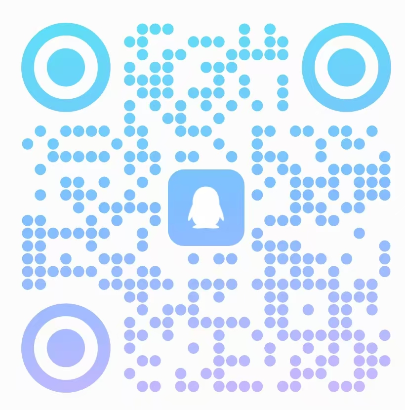

<p align="center">
  
</p>

<p align="center">
  面向 .NET Framework 4.7.2 与现代 .NET 8 WPF 的控件库和通用转换器。
</p>

ZenUI 以克制、清晰的 Zen Style 改善 WPF 控件的默认体验，同时保留原生属性、事件、命令、键盘操作和可访问性契约。

## 核心能力

- 提供 Button、TextBox、DataGrid、DatePicker 等常用 WPF 控件。
- 内置 Light、Dark、HighContrast 主题，支持运行时切换。
- 提供 Compact、Standard、Comfortable 三档界面密度。
- 使用语义化设计 Token，应用无需复制模板即可覆盖颜色与尺寸。
- 覆盖悬停、按下、焦点、选中、禁用、只读和验证错误等交互状态。
- 同时支持 `net472` 与 `net8.0-windows`，并提供独立的通用转换器包。

## 安装

按需安装控件库或转换器包：

```powershell
dotnet add package ZenUI.Wpf
dotnet add package ZenUI.Wpf.Converters
```

| 包 | 用途 |
| --- | --- |
| `ZenUI.Wpf` | 控件、主题与设计 Token |
| `ZenUI.Wpf.Converters` | 可独立使用的通用 WPF 值转换器 |

两个包互不依赖，可以单独安装。

## 快速开始

引入稳定的 XAML 命名空间后即可使用控件，默认样式会由 `Themes/Generic.xaml` 自动加载：

```xaml
<Window
    xmlns:zen="https://zenui.mnorg.cn/xaml/wpf">
    <StackPanel>
        <zen:ZenTextBox Watermark="请输入内容" />
        <zen:ZenButton Content="保存" Variant="Primary" />
        <zen:ZenSwitch IsChecked="True" />
        <zen:ZenAlert Content="保存成功" Severity="Success" />
    </StackPanel>
</Window>
```

应用需要直接使用 ZenUI Token 或具名样式时，可以显式合并默认主题：

```xaml
<ResourceDictionary Source="pack://application:,,,/ZenUI.Wpf;component/Themes/Generic.xaml" />
```

转换器包使用独立的 XAML 命名空间，无需在应用资源中注册实例：

```xaml
<Window
    xmlns:zc="https://zenui.mnorg.cn/xaml/wpf/converters">
    <ProgressBar
        Visibility="{Binding IsLoading,
            Converter={zc:BoolToVisibilityConverter}}" />
</Window>
```

转换器包提供布尔值、空值、集合内容和数值比较到 `Visibility` 的转换，并统一支持结果反转以及 `Collapsed`、`Hidden` 配置。

## 组件

| 类别 | 组件 |
| --- | --- |
| 操作与反馈 | Button、Switch、CheckBox、RadioButton、RadioGroup、Alert、ProgressBar |
| 文本与数值输入 | TextBox、PasswordBox、NumberBox、Slider |
| 选择与日期时间 | ComboBox、ListBox、Calendar、DatePicker、TimePicker |
| 数据与布局 | DataGrid、Expander |
| 浮层与菜单 | Popover、ContextMenu |

TextBox、PasswordBox、ComboBox 和 DataGrid 单元格支持 WPF `Validation.HasError`。Slider 支持水平与垂直方向，ProgressBar 支持垂直方向与 `IsIndeterminate`，ComboBox 支持 `IsEditable`。

## 主题与 Density

默认使用浅色主题。可以在运行时分别切换颜色主题和界面密度：

```csharp
using ZenUI.Wpf.Theming;

ZenThemeManager.ApplyTheme(
    Application.Current.Resources,
    ZenTheme.Dark);

ZenDensityManager.ApplyDensity(
    Application.Current.Resources,
    ZenDensity.Compact);
```

主题管理器默认尊重并持续监听 Windows 高对比度设置。所有控件颜色均通过语义化 `DynamicResource` 获取，应用可以只覆盖单个 Token，不必复制完整控件模板。

完整用法参见[主题、Density 定制与迁移指南](docs/guides/theme-customization.md)。

## 设计原则

Zen Style 的核心不是简单减少元素，而是删除噪声、保留必要信息，并将必要信息呈现得从容、清晰：

- 优先使用留白、排版和对齐建立信息层级，避免装饰堆叠。
- 中性色承担主要结构，强调色只用于主要操作、焦点和明确状态。
- 动画只用于解释状态变化、操作反馈或空间关系。
- 次要能力按需呈现，不与当前任务争夺注意力。
- 极简不能牺牲可读性、可访问性、状态辨识或操作效率。

ZenUI 只调整 WPF 控件的默认值、主题资源和控件模板，不以视觉简化为由删除基类能力。非默认视觉通过依赖属性、设计 Token、具名样式或模板入口保留，并由自动化测试覆盖。

公共 API、状态命名、模板契约、主题资源和可访问性的完整要求参见[控件设计规范](docs/design/component-design.md)。

## 密码安全

`ZenPasswordBox` 不会把密码明文复制到依赖属性或 ViewModel。通过不携带明文的 `PasswordChanged` 事件获知变化，并仅在需要时读取和释放 `SecurePassword`：

```csharp
private void PasswordBox_OnPasswordChanged(object sender, RoutedEventArgs e)
{
    var passwordBox = (ZenPasswordBox)sender;
    using (var password = passwordBox.SecurePassword)
    {
        // 立即验证 password，不要长期保存明文副本。
    }
}
```

## 示例与开发

- `samples/ZenUI.Wpf.Gallery`：控件目录，使用 Prism Region Navigation 和 MVVM。
- `samples/ZenUI.Wpf.PosDemo`：完整业务应用示例。

常用验证命令：

```powershell
dotnet restore ZenUI.Wpf.slnx
dotnet build ZenUI.Wpf.slnx -c Release --no-restore
dotnet test ZenUI.Wpf.slnx -c Release --no-build
```

仓库在 Windows CI 中将编译器与 .NET 分析器警告视为错误，同时验证 `net472`、`net8.0-windows`、NuGet/Symbol 包及多主题、多 Density、多 DPI 视觉快照。正式发布包通过 `.\scripts\pack-release.ps1 -Version <version>` 生成。

## 参与贡献

欢迎提交功能、修复和文档改进。开始开发前请阅读[贡献指南](CONTRIBUTING.md)：

- 从 `main` 创建短期分支，建议使用 `feature/*`、`fix/*`、`docs/*` 或 `chore/*`。
- Git 提交的标题和正文统一使用中文，并简洁说明实际变更。
- 新增或修改控件时，应保留 WPF 原有能力，并覆盖适用的交互状态、主题和可访问性契约。
- 提交前运行 Release 构建、自动化测试及相关打包检查，确保编译器和分析器警告为零。
- 新增或修改的公共 API 必须提供符合项目规范的 XML 文档注释。

## 文档

- [文档索引](docs/README.md)
- [快速开始](website/getting-started/quick-start.md)
- [控件设计规范](docs/design/component-design.md)
- [主题 Token 规范](docs/design/theme-tokens.md)
- [主题、Density 定制与迁移指南](docs/guides/theme-customization.md)
- [测试规范](docs/development/testing.md)
- [C# 注释规范](docs/development/commenting.md)
- [贡献指南](CONTRIBUTING.md)
- [变更记录](CHANGELOG.md)

## 交流与反馈

<h3 align="center">
  <a href="https://qun.qq.com/universal-share/share?ac=1&amp;authKey=kkQCZjWfmhA%2FemIxl7g6kzW0mDbWArzaxhFQWWRm34mSvUdaYJK8X5mYacfvkaWP&amp;busi_data=eyJncm91cENvZGUiOiI2NTA1OTAxNzYiLCJ0b2tlbiI6IkthNXNxYWdkRi9UbDdXdFZCeE1LRjNVT3l4ZSsyNDllYmdNeUtac2U1Z0J1VmlpN0NSVGFKZmdyeUVBY04xd2giLCJ1aW4iOiIxMDQwMTUzNjUzIn0%3D&amp;data=wm78IvqFbkqW1duGxv6xP8Ny_iQXCLWcqSrPYm1rYeDUwUIbY8HwkEAVvMlEx-gYJNpqGKfwh8y9hIXGGQlXig&amp;svctype=4&amp;tempid=h5_group_info">👉 点击加入 ZenUI-WPF QQ 交流群</a>
</h3>

<p align="center">
  群号：<code>650590176</code>
</p>

<p align="center">
  
</p>

## License

ZenUI.Wpf 使用 [MIT License](LICENSE)。
